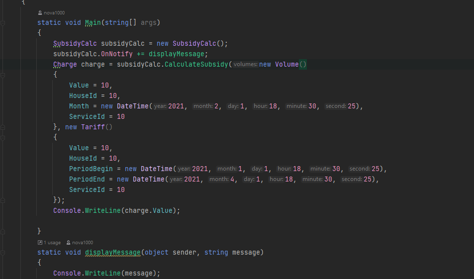
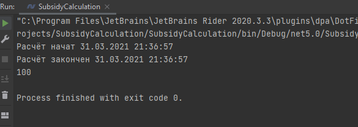
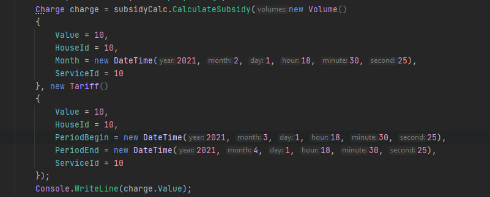
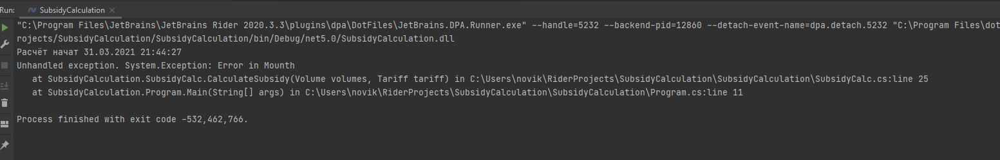

# SubsidyCalculation
Написал программу для проверки работы

Результат работы программы

Изменил диапазон дат, чтоты дата обьема не входила в диапазон

В результате в программе возникло ислечение с сообщением что ошибка в месяце.

